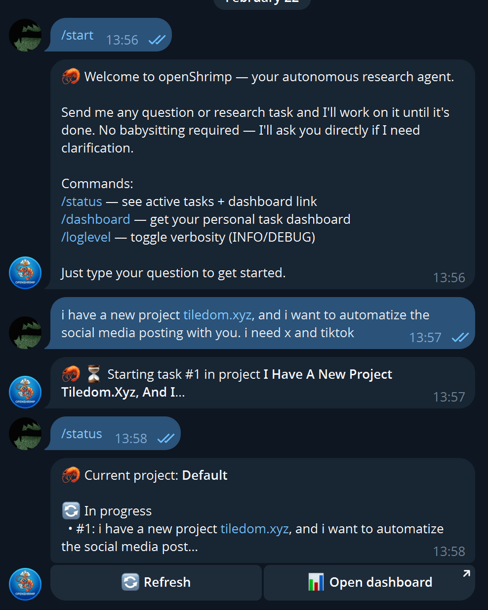
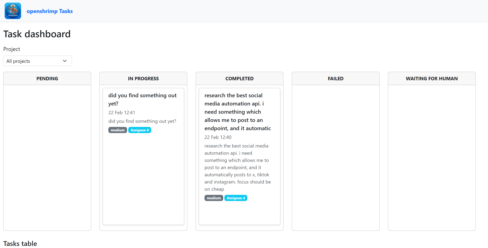

# openShrimp

<p align="center">
  
</p>

<p align="center">
  
</p>
<p align="center"><em>Use openShrimp in Telegram: send a message, get research. <code>/dashboard</code> for your task board.</em></p>

Persistent, task-driven LangGraph research agent with a modular plugin system, PostgreSQL-backed state, and a zero-setup Telegram interface.

> Think OpenClaw with task planning, less token usage and better anti-bot-measure avoidance

<p align="center">
  
</p>
<p align="center"><em>Task tracking dashboard: Trello-style board and searchable table. Get your link via <code>/dashboard</code> in Telegram.</em></p>


## TL;DR — Quickstart (hosted)

**No setup.** Use the hosted version: smaller AI model, but **free** and ready to go.

1. Open [**@OpenShrimpBot**](https://t.me/OpenShrimpBot) in Telegram.
2. Send a message and start researching.

For **paid premium hosted plans** (larger models, higher limits), contact [**info@datafortress.cloud**](mailto:info@datafortress.cloud).


## Self-hosted / Development

The rest of this README describes running openShrimp yourself (self-hosted or local development).


### Why openShrimp Exists

I built openShrimp because I was frustrated with [OpenClaw](https://github.com/OpenClaw/OpenClaw).

OpenClaw is an impressive autonomous research agent, and I respect the project. But after using it in practice I kept running into the same walls. Things that should just work didn't, and things that should be visible weren't. openShrimp is my answer to those gaps.

Here's what was missing:


#### 1. Task Tracking That Actually Persists

OpenClaw operates in an ephemeral loop. Once the conversation ends, the work is gone. There's no record, no audit trail, no way to come back to a half-finished task.

I needed a **database-backed task system** with real states: `pending`, `in_progress`, `waiting_for_human`, `completed`, `failed`. I needed to see every task the agent has touched, and I needed a **visual dashboard** to inspect it all at a glance — a Trello-style board and a searchable table, accessible from a browser.

openShrimp treats research as structured, inspectable work — not disposable prompt output.


#### 2. Works Until It's Done

This is the one that drove me crazy. With most agents you end up babysitting:

> "Continue."
> "Keep going."
> "Now check that source."

openShrimp doesn't need that. You give it a task, it picks it up, and it works on it until it's done — or until it genuinely needs your input, at which point it asks you directly in Telegram and waits for your reply. No repeated nudging. No re-triggering. It just works.


#### 3. You Can See What's Happening

OpenClaw feels like a black box while it runs. You send a message, you wait, and eventually something comes back.

openShrimp gives you full observability:

* Structured task states in PostgreSQL, always queryable
* Optional **DEBUG mode** in Telegram that streams every tool call in real time
* Mid-research notifications — the agent can message you while it's still working
* A web dashboard with live task status, drag-and-drop status changes, and full task details
* Clear separation between orchestration, memory, and tool execution — you know where everything lives


#### 4. Plugin Workshop

I wanted to extend the agent without touching the core. openShrimp uses a dead-simple plugin system:

```
src/plugins/<name>/
  manifest.json
  tool.py
```

Each plugin exports a list of `@tool`-decorated functions. The core agent loads them automatically on startup. No external protocol, no separate service, no boilerplate. Just drop a folder in `src/plugins/` and it works.

Want to add a new research capability? Write a `tool.py`, add a `manifest.json`, done. That's the whole process.


#### 5. Pure Telegram — Zero UI Friction

Setup is:

1. Create a bot via [BotFather](https://t.me/BotFather)
2. Set `TELEGRAM_BOT_TOKEN` in your `.env`
3. Run the bot
4. Done.

No web UI to deploy. No frontend to configure. Telegram is the interface. Send a message, get a research result. Send `/status` to see what's running. Send `/dashboard` to get a link to your personal web dashboard.

**Environment variables (Telegram bot):**

| Variable | Description |
|----------|-------------|
| `TELEGRAM_BOT_TOKEN` | **Required.** From BotFather. |
| `DEFAULT_AGENT_USER_ID` | Optional. DB id for the agent user (default: auto-created on startup). |
| `DASHBOARD_BASE_URL` | Base URL for dashboard links the bot sends (default: `http://localhost:8000`). |
| `AUTO_START_TASKS` | If true (default), start tasks immediately using last/default project; if false, show project picker each time. |
| `AGENT_MAX_RETRIES` | Number of retries on transient failures (e.g. timeouts, 5xx). Default: 2. Retry backoff is capped below the watchdog so in-progress tasks are not reset during retries. |
| `HEARTBEAT_WATCHDOG_MINUTES` | Minutes without a heartbeat before an IN_PROGRESS task is reset to pending. Default: 10. |

**Multi-user support:** Each Telegram account automatically gets its own DB user row, default project, task history, and filesystem workspace (`workspaces/<telegram_user_id>/<project_name>/`). No configuration required — isolation is automatic on first message.


#### 6. Stealth Web Research That Actually Works

This was the other big pain point. OpenClaw's browser gets blocked constantly — anti-bot detection, CAPTCHAs, fingerprinting. Every other research task would stall because a website refused to serve the page.

openShrimp uses a hardened browsing stack:

* **[pyppeteer-stealth](https://github.com/MeiK2333/pyppeteer_stealth)** — stealth patches for Chromium that defeat most bot detection
* **Browserless** stealth mode as an optional remote backend
* **[CapSolver](https://www.capsolver.com/)** integration — optional AI-powered CAPTCHA solving when stealth alone isn't enough
* User-agent rotation and fingerprint control
* Automatic local Chrome fallback if the remote browser is unavailable

The result: long-running research sessions that don't get interrupted by "please verify you're human" walls.


### What openShrimp Is

* A **LangGraph-based** autonomous research agent
* With **persistent task tracking** in PostgreSQL
* Long-term memory via **PGVector**
* A **plugin-first** tool architecture
* A **Telegram-native** execution model
* Designed for **reliability, inspectability, and autonomy**

It is not a demo agent. It is designed to behave like a structured autonomous worker.


### How It Works

```
User (Telegram)
  │
  ▼
Telegram Bot  ──────────────────────────────────────────┐
  │  • detects effort level (quick / normal / deep)     │
  │  • creates a DB task (PostgreSQL)                   │
  │  • picks the right LLM model for the effort level   │
  ▼                                                     │
Thread Pool (up to 4 workers)                           │
  │                                                     │
  ▼                                                     │
LangGraph Agent                                         │
  │  loop:                                              │
  │    1. LLM decides which tool(s) to call             │
  │    2. Tool node executes them (browser, memory, …)  │
  │    3. Heartbeat → DB (proves the task is alive)     │
  │    4. Repeat until done or budget exhausted         │
  │                                                     │
  │  can call ask_human → blocks thread, waits for      │
  │  Telegram reply, then resumes                       │
  │                                                     │
  ▼                                                     │
Task marked completed / failed in DB  ◄─────────────────┘
  │
  ▼
Answer sent back to Telegram
```

#### Effort-based model routing

openShrimp detects how much effort a task needs from keywords in the message and routes it to the right model:

| Effort | Trigger keywords | Default model | Tool-call budget |
|--------|-----------------|---------------|-----------------|
| **Quick** | "quick", "briefly", "tl;dr", "summary only" | `openai/gpt-oss-120b` (fast/cheap) | 5 calls |
| **Normal** | _(everything else)_ | `deepseek/deepseek-v3.2` | 10 calls |
| **Deep** | "deep dive", "thorough", "comprehensive", "exhaustive" | `z-ai/glm-5` (thinking model) | 25 calls |

Override any model with environment variables:

| Variable | Description |
|----------|-------------|
| `OPENROUTER_MODEL` | Global fallback model (default: `deepseek/deepseek-v3.2`). |
| `OPENROUTER_MODEL_QUICK` | Model for quick/low-effort tasks. |
| `OPENROUTER_MODEL_NORMAL` | Model for normal tasks. |
| `OPENROUTER_MODEL_DEEP` | Model for deep research tasks. |

The agent sees its remaining tool budget at every step ("Tool budget: 3/10 calls remaining") and wraps up gracefully instead of hitting a hard cutoff.

#### Reliability

* **Automatic retries** — transient failures (timeouts, rate limits, 5xx errors) are retried up to `AGENT_MAX_RETRIES` times (default: 2) with backoff. Non-transient errors fail immediately.
* **Heartbeat watchdog** — every tool call sends a heartbeat to the DB. If an agent thread dies silently, the watchdog resets the task to `pending` after `HEARTBEAT_WATCHDOG_MINUTES` (default: 10) so it can be retried.
* **Process-crash recovery** — on startup, any `IN_PROGRESS` tasks from a previous bot process are reset to `pending`.
* **ask_human gating** — an LLM evaluator rejects trivial questions before they reach the user, plus a hard cap of `MAX_ASKS_PER_TASK` (default: 2) per task.

#### Plugins

Each plugin lives in `src/plugins/<name>/` with a `manifest.json` and a `tool.py` exporting a `TOOLS` list. The agent loads all plugins at startup.

| Plugin | What it does |
|--------|-------------|
| `browser_research` | Stealth Chromium browsing with CAPTCHA solving |
| `memory_rag` | Long-term memory via PGVector (add/retrieve) |
| `task_tracking` | Create, update, and list tasks from within the agent |
| `telegram_notify` | Send mid-research messages to the user |
| `human_input` | Ask the user a question and block until they reply |
| `filesystem` | Read/write/search files in the project workspace (`workspaces/<telegram_user_id>/<project_name>/`) |


### Dashboard Access

The web dashboard (task board and table) is **locked by default**. Access requires a secret token in the URL.

| Access | Behavior |
|--------|----------|
| **No token or invalid token** | `403 Forbidden` — dashboard does not load. |
| **User token** | Scoped view: only that user's projects and tasks. |
| **Admin token** | Unscoped view: all projects and tasks. |

**How to get your link:**

* Send `/dashboard` in Telegram — the bot replies with your personal dashboard URL.
* Send `/status` — includes the dashboard link at the bottom.

**Environment variables:**

| Variable | Description |
|----------|-------------|
| `DASHBOARD_ADMIN_TOKEN` | Secret string for admin access. Use `?token=<value>` to see all data. Leave unset if not needed. |
| `DASHBOARD_BASE_URL` | Base URL for dashboard links the bot sends (default: `http://localhost:8000`). Set to your public URL for production. |


### Deploying with Helm (Kubernetes)

Deploy openShrimp to a Kubernetes cluster using the included Helm chart. The chart runs the same stack as docker-compose: frontend (API/visualizer), agent (Telegram bot), pgvector, and browserless.

**Prerequisites:** A cluster with a [cloudflared](https://developers.cloudflare.com/cloudflare-one/connections/connect-apps/install-and-setup/installation/) ingress controller (or another ingress class; override in values), `kubectl`, and `helm`.

**1. Create a Secret from your `.env`**

The chart does not embed secrets. Create a Kubernetes Secret from the project `.env` so all pods can use it:

```bash
kubectl create namespace openshrimp
kubectl create secret generic openshrimp-env --from-env-file=.env -n openshrimp
```

Use the same name as `existingSecret` in `helm/values.yaml` (default: `openshrimp-env`). Create the secret in the namespace where you will install the chart.

**2. Install or upgrade the release**

```bash
helm upgrade --install openshrimp ./helm -n openshrimp
```

Override settings with `-f my-values.yaml` or `--set` as needed.

**3. Default URL**

The visualizer (dashboard) is exposed via ingress at **openshrimp.datafortress.cloud** (ingress class: `cloudflared`). To have the Telegram bot send dashboard links with this URL, set `DASHBOARD_BASE_URL` in your `.env` to `https://openshrimp.datafortress.cloud` before creating the secret.

To use a different host or TLS, adjust `ingress.hosts` and `ingress.tls` in `helm/values.yaml`. Resource limits (e.g. for browserless) can be set under each component in `values.yaml`.
